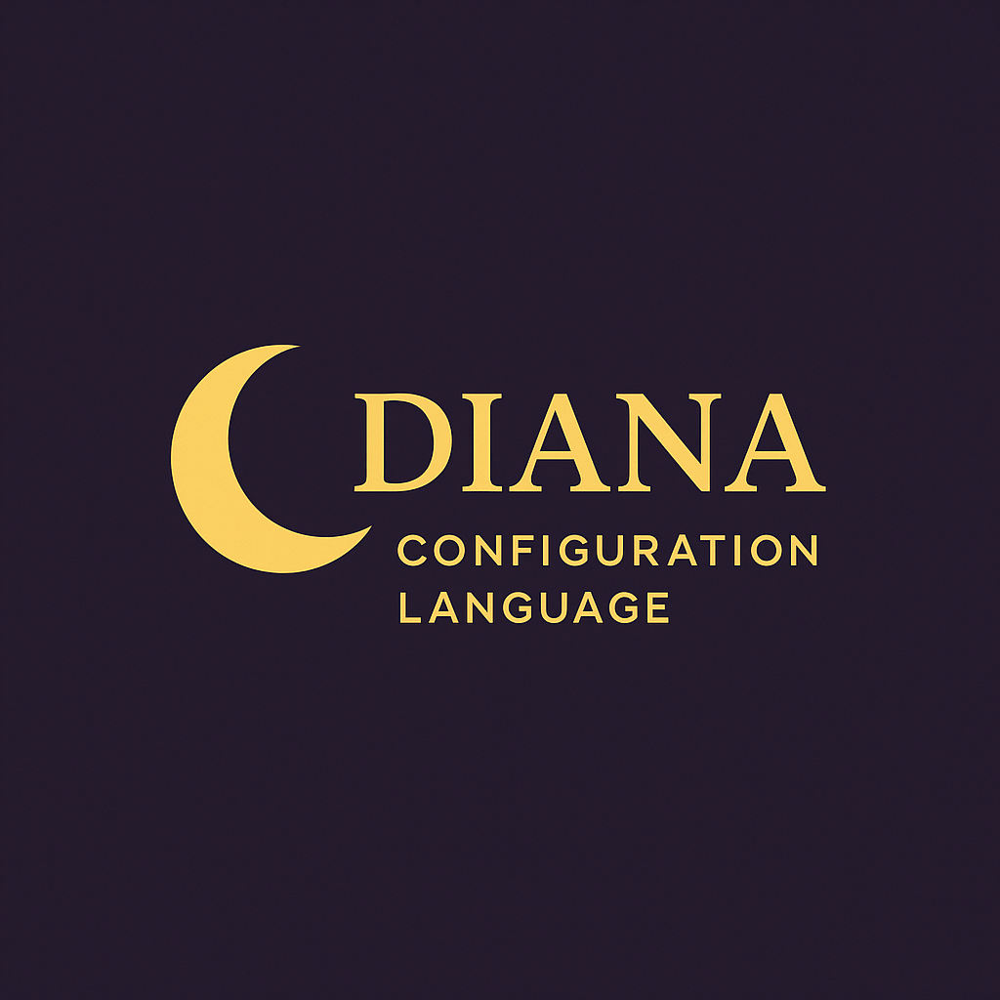

# Diana



Diana is a configuration language designed for clarity and tooling support. This monorepo contains the core language implementation and related tools, including a VS Code extension.

## How Diana Compares

Diana is:
- **YAML with lexical type**: Like YAML, but with explicit, reliable type handling.
- **TOML with nesting structure**: Supports TOML-style nested objects and sections.
- **JSON with concise grammar**: Offers JSON's data model with a more concise, human-friendly syntax.

## Monorepo Structure

- **packages/diana-lang**: The core implementation of the Diana configuration language in TypeScript.
- **packages/vscode**: A Visual Studio Code extension for Diana, providing syntax highlighting and language support.

## Getting Started

This project uses [pnpm](https://pnpm.io/) for managing dependencies in a monorepo setup.

1. **Install dependencies:**
   ```sh
   pnpm install
   ```
2. **Build all packages:**
   ```sh
   pnpm build
   ```
3. **Run tests:**
   ```sh
   pnpm test
   ```
4. **Lint the codebase:**
   ```sh
   pnpm lint
   ```

## Development

- Each package contains its own `package.json` and can be developed independently.
- The root scripts (`build`, `test`, `lint`) run the respective commands across all packages.
- TypeScript is used throughout, with strict settings for reliability.

## License

MIT
